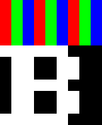
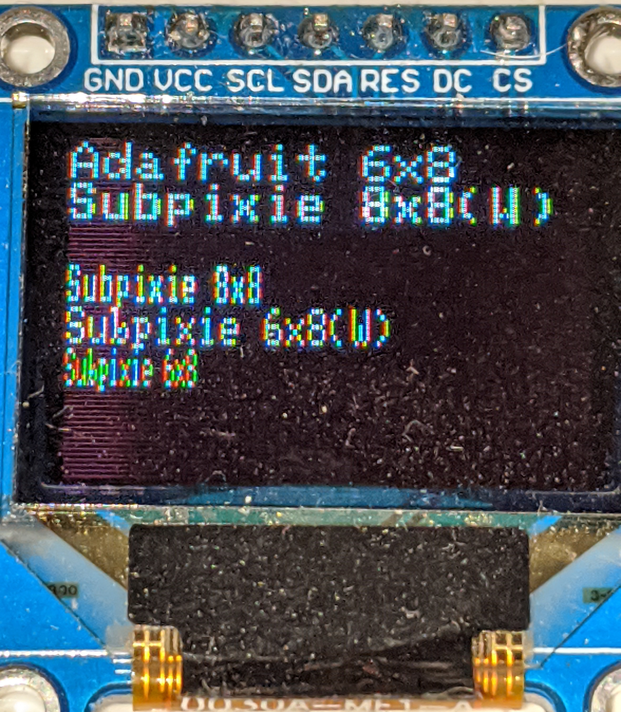

# What is it?
Subpixie is a simple text renderer library for Arduino for use with small RGB LCD displays.
It treats each R, G, and B component as it's own pixel allowing for more text in the same space at the cost of readability.



In the example above the letter B is 8 pixels wide, or more accurately, 7 are used with one blank column on the right.
By treating each colour subpixel as it's own pixel this 8 pixel wide font can be represented using only 3 full pixels on your screen.

Depending on the size of your screen you can fit in a lot more text this way, but it does come at the cost of readability.

# What is wide mode?
Since these pixels are taller than they are wide, text can look a bit squished and harder to read.
Wide mode uses twice the amount of subpixels horizontally which makes everything much more readable, but also still saves screen space.

Generally, you should almost always use wide mode.

# What does it look like?


This image shows how it looks compared to the built-in 6x8 font in Adafruit's GFX library.
It shows the tradeoff between readability and size.

# Requirements
Subpixie is not a complete graphics library, it can only render text and it requires the use of existing libraries to initialize the display.

Subpixie also requires callbacks to those libraries to perform it's writes to the screen.

# Required callbacks
## SetAddressWindow
Subpixie needs to be able to tell the LCD where to draw.
Since there are so many different libraries and so many LCDs, the user must provide callbacks to those functions.

As an example, let's look at a callback for the Adafruit GFX library:

```
void Adafruit_SetAddressWindow( int x0, int y0, int x1, int y1 ) {
  LCD.setAddrWindow( x0, y0, ( x1 - x0 ), ( y1 - y0 ) );
}
```

LCD Is the display object containing the setAddrWindow method.

Because Adafruit's setAddressWindow method uses width and height for the 3rd and 4th parameters and Subpixie uses coordinates for the address window, the width and height are calculated by subtracting the start coords from the end coords.

## WritePixels
There are many different ways LCDs expect data to be written to them, far more than a text library can handle. To get around this the user will need to give Subpixie a callback to write data to the LCD using it's native libraries.

Example for the Adafruit SPITFT library:
```
void Adafruit_WritePixels( uint16_t* Buffer, size_t Count ) {
  LCD.writePixels( Buffer, Count, true, false );
}
```
LCD is the display object containing the writePixels method.
Buffer is a pointer to (Count) 16 bit words containing the image data to be drawn.
Count is the number of 16 bit words to draw, not the total size of the buffer.
